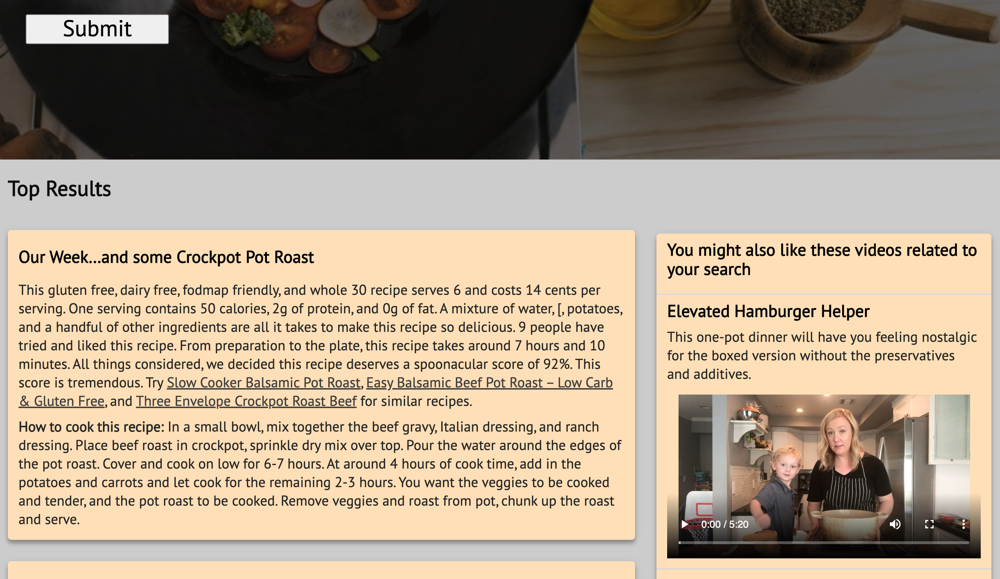
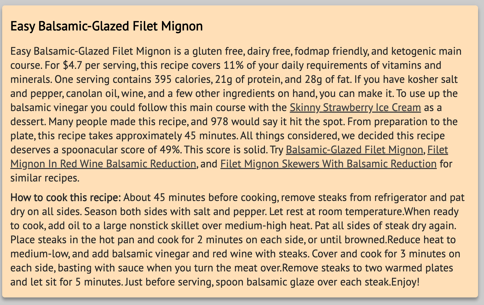
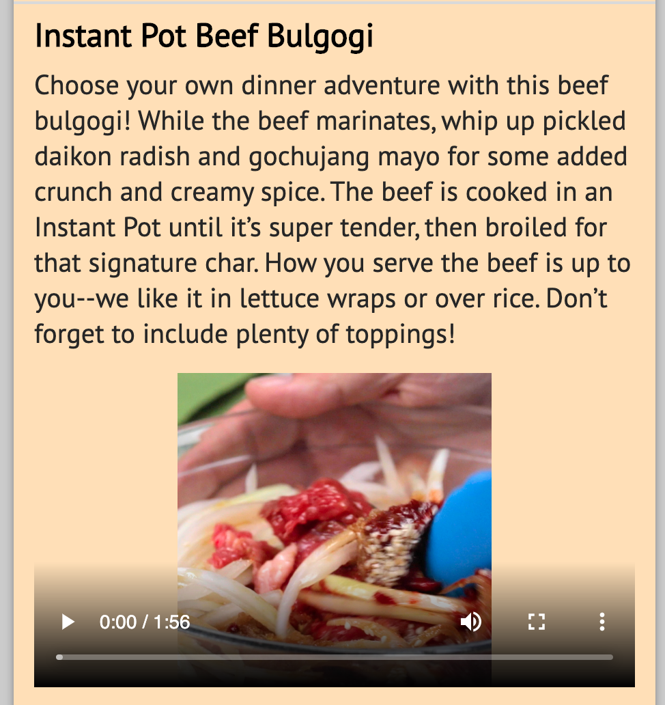

# Recipe-Search-App.IO

Users can search for recipes by name of food or ingredients, by melding data from two different APIs.

## Summary

This app helps users search for recipes by name of food or ingredients. The app takes input from the users and uses the input to fetch data from - [Recipe-food-nutrition API](https://rapidapi.com/spoonacular/api/recipe-food-nutrition/pricing) and - [Tasty API](https://rapidapi.com/apidojo/api/tasty). Results returned from the request include recipe name, description and instructions.

## Screenshots
Landing Page:

Results List

Sample Result 1:

Sample Result 2:

## Built With

* HTML
* CSS
* JavaScript
* JQuery

## Demo

- [Live Demo](https://mmj05.github.io/recipe-search-app/)

## Authors

* **Muhaimin Jobayer**

